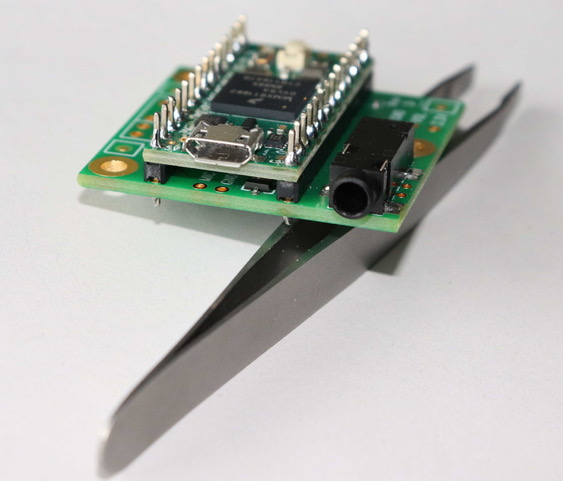
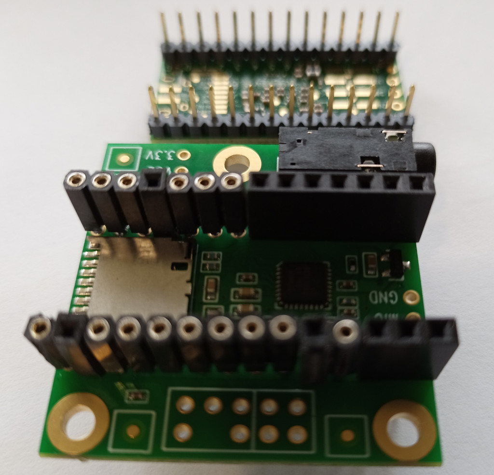
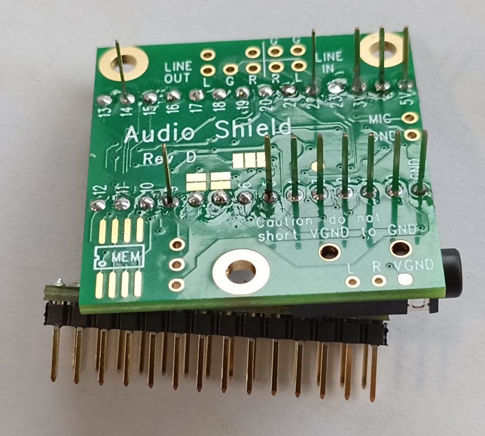
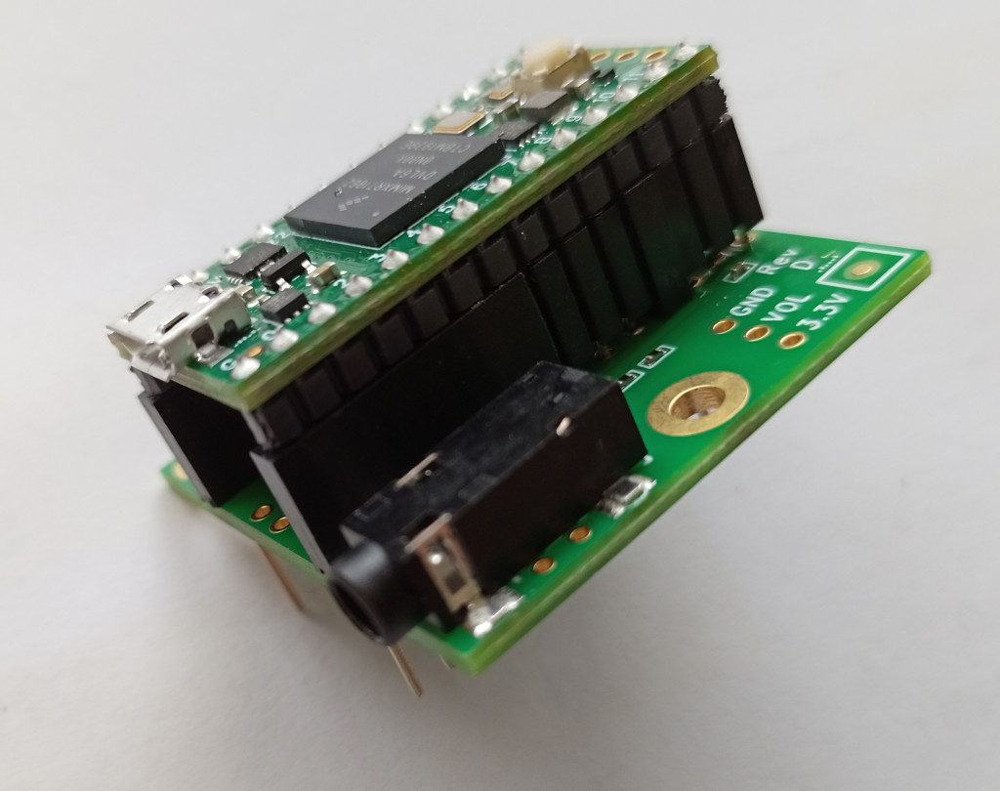
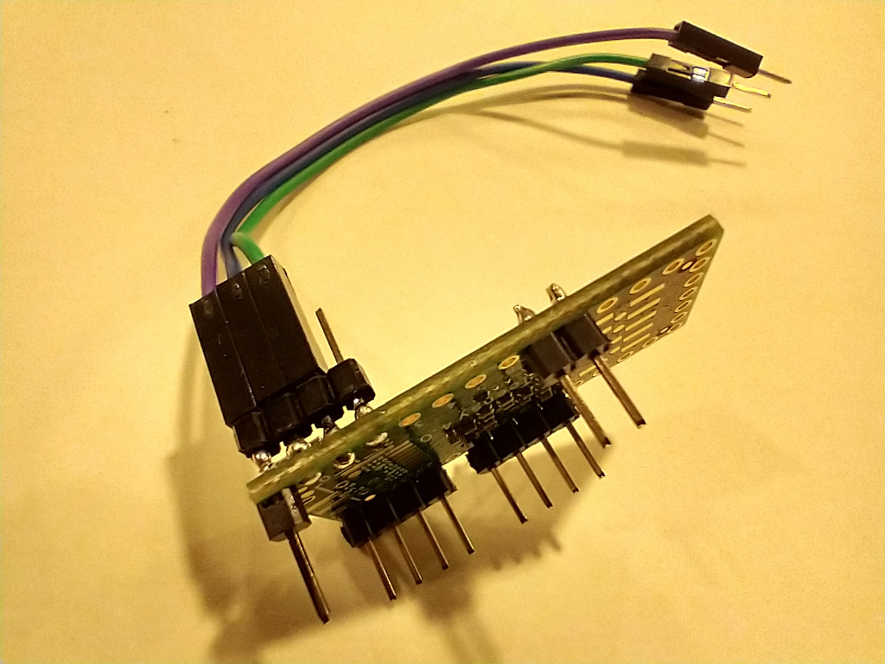
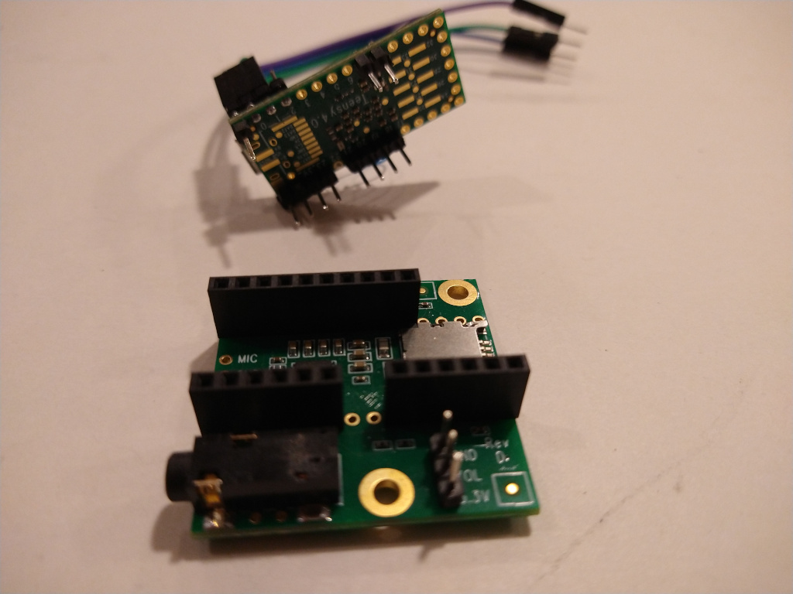

# K3NG Arduino CW Keyer for Teensy 4 and Hermes-Lite

This is a fork of the K3NG CW keyer which runs on a [Teensy 4](https://www.pjrc.com/teensy/). The keyer is also a USB audio device. This allows for low latency CW sidetone to be mixed in with received audio from a [Hermes-Lite 2.0](http://www.hermeslite.com/) amateur softwareware defined radio or other radio. This project is currently a DIY project with instructions below for those who feel comfortable with some light soldering and Arduino programming.

## Hardware

A [Teensy 4](https://www.pjrc.com/store/teensy40.html) and [Teensy 4 Audio Shield](https://www.pjrc.com/store/teensy3_audio.html) are required for this project. These can be purchased from the previous links or from [sparkfun](https://www.sparkfun.com/), [adafruit](https://www.adafruit.com/), [mouser](https://www.mouser.com/), [digikey](https://www.digikey.com/) or [amazon](https://www.amazon.com/). Make sure to order the Teensy 4 and Teensy 4 Audio Shield.

### Connect Teensy 4 to Audio Shield

The first step is to connect the Teensy 4 to the Audio Shield while keeping access to other Teensy 4 pins for the CW key. There are several ways to do this as seen below.

You can solder the Teensy 4 directly to the Audio Shield while leaving some pins extruding for later connection to the CW key.

You can use "stacking headers and sockets" to mate the Teensy 4 with the Audio Shield. The long pins from the socket then allow you to plug into a breadboard.

Not all pins must connect the Teensy 4 with the Audio Shield. You can pick and choose where to use headers and sockets. Some of the header pins can go up or down. Both ground pins, 3.3V and pins 7,8,18,19,20,21,23 must connect. See the section "Signals to Teensy" on [this page](https://www.pjrc.com/store/teensy3_audio.html) for more details. Note that the data storage and thumbwheel pins are optional.

### Connect Teensy 4 to a Key

The current pin assignment is as shown below.

| Pin | Function |
| --- | -------- |
|  0  | Paddle Right |
|  1  | Paddle Left  |
|  2  | Straight Key |
|  3  | PTT in |
|  4  | CW Keyed Output |
|  5  | PTT out |

These pin assignments are subject to change and expand. They may also depend on the particular firmware running on the Teensy 4. For latest pin assignments please check:

 * [TeensyWinkeyEmulator pins.h](https://github.com/dl1ycf/TeensyWinkeyEmulator/blob/main/pins.h)
 * [hasak config.h](https://github.com/recri/hasak/blob/main/config.h)
 * [k3ng keyer_pin_settings_teensy_usbaudiomidi.h](https://github.com/softerhardware/k3ng_cw_keyer/blob/master/k3ng_keyer/keyer_features_and_options_teensy_usbaudiomidi.h)

When connecting your paddle or straight key to the Teensy 4, closing the paddle or key should ground the pin. It is recommended to include a 10nF capacitor on each input as seen in this [Nano Keyer schematic](https://github.com/k3ng/k3ng_cw_keyer/wiki/210-Build:-Schematic). **No 10K pullups** are needed as seen in the schematic. The Teensy 4.0 has built-in pullups.

## Programming the Teensy 4

The Teensy 4 is programmed via a usb connection to a host computer. Precompiled Teensy 4 firmware (.hex) files are available for download. First, download and install the Teensy loader application for your operating system as described on [this page](https://www.pjrc.com/teensy/loader.html). Next, download the latest target firmware:

 * [TeensyWinkeyEmulator .hex](./releases/TeensyWinkeyerEmulator_20210419.hex)
 * [hasak .hex](./releases/hasak_20210419.hex)
 * [k3ng with USB audio .hex](./releases/k3ng_keyer_teensyusbaudio.hex)

Finally, complete the instructions for your operating systems but use the downloaded .hex file from above instead of the example .hex file. 

## Ctrlr

TBD: Basic description, download and use instructions for Ctrlr MIDI control panel.

## Development

TBD: Instructions on how to setup the custom teensy4 and Audio library to customize and rebuild the firmware

## K3NG Arduino CW Keyer

The K3NG Keyer is an open source Arduino based CW (Morse Code) keyer with a lot of features and flexibility, rivaling commercial keyers which often cost significantly more. The code can be used with a full blown Arduino board or an AVR microcontroller chip can be programmed and used directly in a circuit. This keyer is suitable as a standalone keyer or for use permanently installed inside a rig, especially homebrew QRP rigs. It’s open source code so you can fully customize it to fit your needs and also perhaps learn from it or find coding ideas for other projects.

Documentation is located [here](https://github.com/k3ng/k3ng_cw_keyer/wiki).
