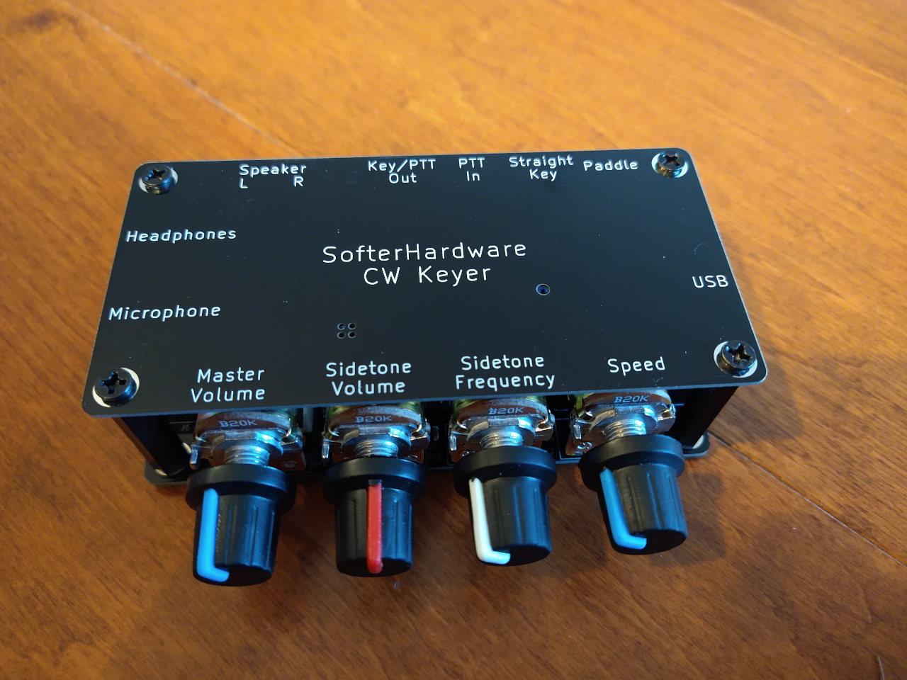

# CW Keyer for Teensy 4 and Hermes-Lite

This is a software CW keyer for the [Teensy 4](https://www.pjrc.com/teensy/). The keyer is also a USB audio device. This allows for low latency CW sidetone to be mixed in with received audio from a [Hermes-Lite 2.0](http://www.hermeslite.com/) amateur softwareware defined radio or other radio. This project is currently a DIY project with instructions below for those who feel comfortable with some light soldering and Arduino programming.

## Hardware

A [Teensy 4](https://www.pjrc.com/store/teensy40.html) This can be purchased from the previous links or from [sparkfun](https://www.sparkfun.com/), [adafruit](https://www.adafruit.com/), [mouser](https://www.mouser.com/), [digikey](https://www.digikey.com/) or [amazon](https://www.amazon.com/). Make sure to order the Teensy 4.

The SofterHardware CW Keyer Teensy 4.0 carrier board as shown below is also required.

## Programming the Teensy 4

The Teensy 4 is programmed via a usb connection to a host computer. Precompiled Teensy 4 firmware (.hex) files are available for download. First, download and install the Teensy loader application for your operating system as described on [this page](https://www.pjrc.com/teensy/loader.html). Next, download the latest target firmware:

 * [TeensyWinkeyEmulator .hex](./releases/20220109/TeensyWinkeyEmulator.ino.hex)
 * [hasak .hex](./releases/hasak_20210419.hex)

Finally, complete the instructions for your operating systems but use the downloaded .hex file from above instead of the example .hex file.

## Ctrlr

TBD: Basic description, download and use instructions for Ctrlr MIDI control panel.

## Development

This git repository uses several submodules to collect various projects into a single repository. You must initialize submodules whenn intially cloning:

git clone --recurse-submodules git@github.com:softerhardware/CWKeyer.git

After that, also be sure to pull updates from submodules:

git pull --recurse-submodules

You can find more details about how to work with git submodules on the internet.

### Teeny Libraries

Current development is done using [Arduino IDE 1.8.19](https://www.arduino.cc/en/software) and [Teensyduino 1.56](https://www.pjrc.com/teensy/td_download.html). Please make sure those are installe.

Updated libraries are required for glitchless 48kHz audio with the CW keyer hardware. These libraries are provided in this git repository. An easy way to use these libraries is to add symbolic links to the new libraries from the arduino IDE install. This is described below for Linux and MacOS systems.

Be sure to select the "Teensy 4.0" board in the Tools-->Boards-->Teensiduino menu, and to select the "Serial + Midi + Audio" USB model in the Tools-->USB type menu,
otherwise compilation will fail.

Install teensy  library update for linux:
-----------------------------------------

 1. cd arduino-1.8.19/hardware/teensy/avr
 2. rm -rf cores   (This must be removed or moved outside of the arduino-1.8.19 area otherwise arduino will still pickup this code)
 3. ln -s /home/shaynal/CWKeyer/libraries/teensy/cores .   (Substitute the path for your local git pull of the CWKeyer repository)
 4. cd libraries
 5. rm -rf Audio   (See step 2 comments)
 6. ln -s /home/shaynal/CWKeyer/libraries/teensy/Audio .   (See step 3 comments)
 7. ln -s /home/shaynal/CWKeyer/libraries/teensy/CWKeyerShield .   (See step 3 comments)

Install teensy library update for MacOS:
----------------------------------------

(Added by DL1YCF. Note this is best done from the "terminal" app, then this is very similar to the
linux case).

All the libraries are inside the Teensyduino "app" file bundle (which is a directory tree)
/Applications/Teensyduino.app. Locate a sub-folder called "Audio", this will point you to
the libraries for the Teensy. Normally this is located in

/Applications/Teensyduino.app/Contents/Java/hardware/teensy/avr/libraries

You can copy the "Audio" folder within that folder to a safe place (or just delete it),
and do the same to the "cores" folder one step higher, that is, the "cores" folder within

/Applications/Teensyduino.app/Contents/Java/hardware/teensy/avr

Then proceed as in the linux case, that is, add a symbolic link named "cores" in the .../teensy/avr
folder and two symbolic links called "Audio" and "CWKeyerShield" in the
.../teensy/avr/libraries folder, that point to the directories "Audio", "cores" and
"CWKeyerShield" where you have placed them after down-loading from this repository.

